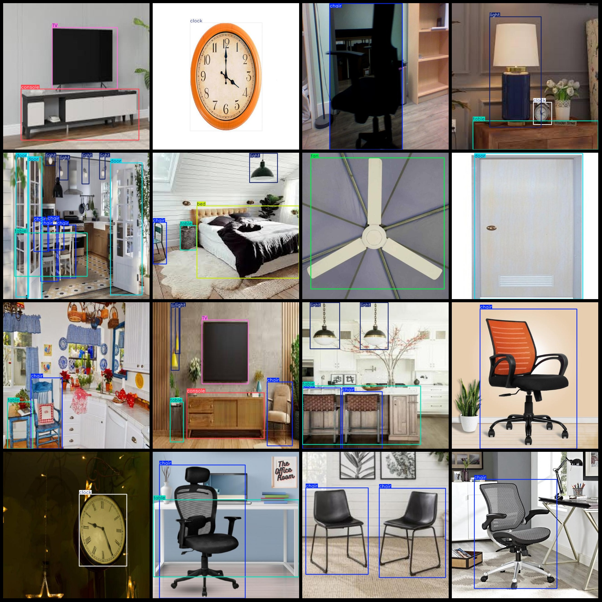

# Indoor Object Detection Dataset VOC+YOLO-1453 Categories

Dataset format: Pascal VOC format + YOLO format (without split path's txtfile, only contain jpgimage and corresponding VOC format xmlfile and yolo format txtfile)
number of images: 1453  
annotation count: 1453  
annotation count: 1453  
annotationnumber of classes: 10  
Annotation class names: ["TV", "bed", "chair", "clock", "console", "door", "fan", "light", "sofa", "table"]
boxes per class:   
The number of TV boxes in the system is 98.
Bed box count = 110
Chair box count = 1773
Clock box count = 234
Console box count = 89
Door box count = 364
Fan box count = 168
Light box count = 857
Sofa box count = 208
Table box count = 845
total boxes: 4746  
images per class:   
TV images = 94  
bed images = 100  
chair images = 851  
clock images = 162  
console images = 82  
door images = 265  
fan images = 157  
light images = 383  
sofa images = 170  
table images = 605
image resolution: 640x640  
Annotation Tool: labelImg
Annotation Rules: Draw a rectangle around the class.
Important Notes: The dataset does not have a training/validation/test split, so you need to divide it yourself.
Special Statement: This dataset does not guarantee the accuracy of the trained model or weight file.
Image Preview:
## Images

Here is a pay link on Stripe ( https://buy.stripe.com/3cs8yP7sY87d0vu9AB ). Please contact me lonlonago@foxmail.com after funding $89, and I will send you a complete data files , thank you!

